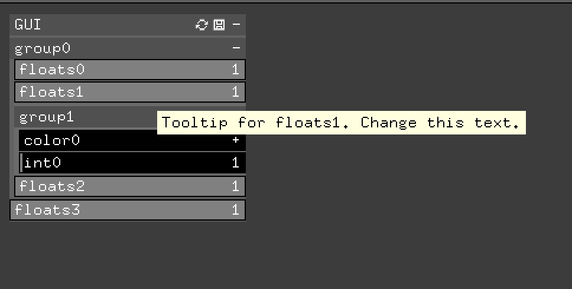

# ofxGuiTooltip

This addon allows you to add tooltips to openFrameworks' ofxGui

There are two examples:

* **example-json**:   
 	Shows how to load tooltips from a json file. This is the preferred and easiest way to add tooltips to the gui.  
	If the json file you specified when setting up the tooltips does not exist a new file will be created.  
    If the json file does not contain the tooltip for a gui widget it will create it and store it back into the same file, following the structure of the gui (how elements are nested).  
    You dont need to worry about the json structure as it will get generated automatically. Although, if you change the structure of the gui or even the name of an ofParameters you will need to edit the json file. You will see the newly added elements as empty strings. you will need to fill it with the needed info.  
	Thus, once you have your ofxGui ready, add a tooltip instance and as shown in the example and run the app. The tooltips will not get shown, as there are none so far, but a new json file will be created in which you can add the tooltips. Run the app again and you'll se the tooltips.

* **example-inline**:  
Shows how to add tooltips directly in the code without needing to use a json file. 

## License

Check file `license.md`.

## Installation

Just copy this repository into the addons folder inside your openframeworks directory.

